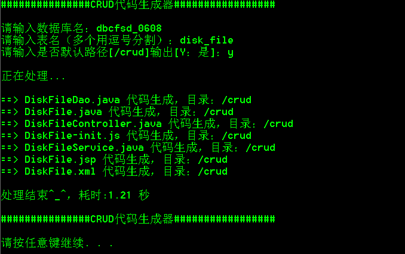

## 代码生成器
i want to test get merge
>使用场景:springMvc+mybatis+mysql+fastjson 项目

需求：由于手写crud太痛苦,如果字段一多理更无法忍受
所以想根据现在正在开发的项目做一个代码生成器程序，
来生成crud代码，目标是只需要要少量的配置和输入
就成生成可用于生产环境运行的代码，根除手写crud的痛苦。

### 生成的的内容--------
+ 实体类Bean
+ Dao层接口
+ Service层类
+ Controller层类
+ 前端JSP(只用于特定项目)
+ 前端JS(只用于特定项目)

### 技术栈
>java8 + freemaker + dbutils + druid + 多线程 + maven

### 设计思想
配置数据库连接相关信息，使用命令行窗口提示用户输入数据库名(schema)和要生成的表名(tableName)
根据schema和tablenName查询mysql存储字段表字段相关信息的数据库information_schema
根据表字段信息，使用freemaker模板技术动态生成JavaBean、Dao、mapper、Service、Controoler、
Js（特定项目）、JSP（特定项目）。同时在生成代码文件时可以指定输出路径，可以直接指定项目工作
空间(workspace)中真实项目路径(到项目对应磁盘的绝对路径)，一劳永逸,
这样代码生成后不用做任何其它的工作，只要启动服务就可以运行。

### 运行效果
使用 mvn assembly:assembly 打包后生成code_generator-1.0-SNAPSHOT-jar-with-dependencies.jar

写一个运行脚本(coder_v1.0.bat)放在与jar包同级目录
```
@echo off
color 0a
java -jar code_generator-1.0-SNAPSHOT-jar-with-dependencies.jar
pause

```
双击 coder_v1.0.bat


